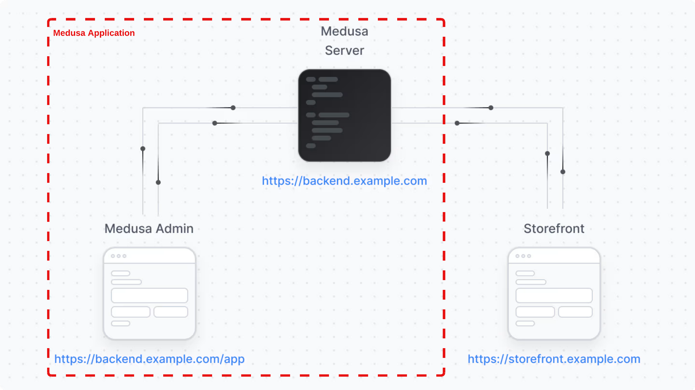

# e-commerce

Medusa JS

## Local Development Setup Guide

- 1.) Setup the local Postgres database via [docker-compose](docker-compose.yml) file
  ``` shell
    docker-compose up -d
  ```
- 2.) Create a new Medusa Admin User
  ```shell
    cd nongped
    npx medusa user -e admin@medusajs.com -p supersecret
  ```

## Quick Guide

- Module DB Generation
  ```shell
  npx medusa db:generate blog
  ```

## Medusa Architecture



- medusa-api (stateless, multiple tasks)
- medusa-api-report-worker (stateless, multiple tasks)
- medusa-api-worker (stateless, multiple tasks)
- medusa-fulfillment

----

- DB- Postgres (RDS)
- Redis - Elastic Cache